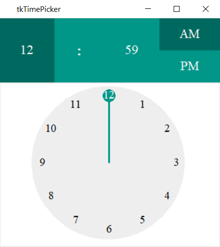
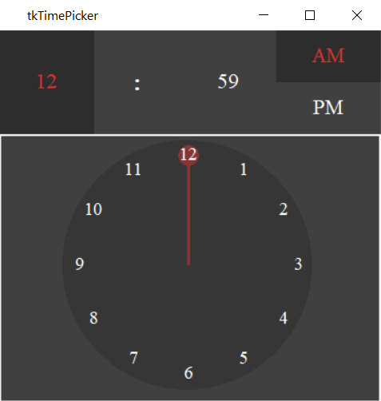
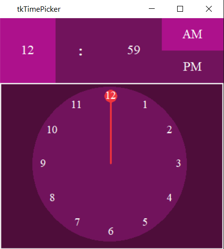
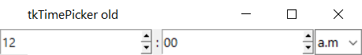
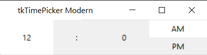

# tkTimePicker

This is a simple and fully customizable timepicker widgets made for tkinter. You can make use of
three types of timepicker:

1. clock timepicker
2. old-spin timepicker
3. modern-spin timepicker

quick example

```python
import tkinter as tk
from tktimepicker import clockTimePicker

root = tk.Tk()

time_picker = clockTimePicker.AnalogPicker(root)
time_picker.pack()

root.mainloop()
```

for more examples refer [Examples](examples),
for documentation read [Documentation](Documentation.md)

**Clock time picker**

Available themes:

<a id="themes"></a>
**NavyBlue**



**Dracula**



**purple**



**Old-spin timepicker**



**Modern-spin timepicker**


